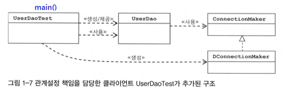
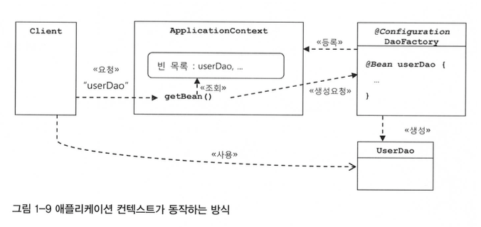

오브젝트와 의존관계
=====
## 목차
1. [초난감 DAO](#초난감-DAO)
2. [DAO의 분리](#DAO의-분리)
3. [DAO의 확장](#DAO의-확장)
4. [제어의 역전](#제어의-역전)
5. [스프링의 IoC](#스프링의-IoC)
6. [싱글톤 레지스트리와 오브젝트 스코프](#싱글톤-레지스트리와-오브젝트-스코프)
7. [의존관계 주입](#의존관계-주입)
8. [XML을 이용한 설정](#XML을-이용한-설정)
9. .

1장의 주제는 오브젝트와 의존관계다. 스프링의 등장 배경이 객체와 그 관계, 즉 객체지향 프로그래밍[1]을 잘 하도록 한다는 점에서 일맥상통한다.

- - -
1. 조영호의 객체지향의 사실과 오해에서는 객체지향에 대해 다음과 같이 설명한다.  
```txt
1. 객체지향이란 시스템을 상호작용하는 '자율적인 객체들의 공동체'로 바라보고 객체를 이용해 시스템을 분할하는 방법이다.
2. 여기서 자율적인 객체란 상태와 행위를 함께 지니며 스스로 자기 자신을 책임지는 객체를 의미한다.
3. 객체는 시스템의 행위를 구현하기 위해 다른 객체와 '협력'한다. 각 객체는 협력 내에서 정해진 '역할'을 수행하며 역할은 관련된 '책임'의 집합이다.
4. 객체는 다른 객체와 협력하기 위해 메시지를 전송하고, 메시지를 수신한 객체는 메시지를 처리하는 데 적합한 메서드를 자율적으로 선택한다.
```

### 초난감 DAO

거창하게 프레임워크, 패턴을 먼저 언급하는 대신 책에선 짧은 코드를 개선[1]해나가면서 개념을 제시한다. 이때 제시된 냄새나는 코드가 UserDao[2]다. 클래스명에서 알 수 있듯, 이 클래스의 역할[3]은 DB에 접근해 데이터를 CRUD하는 것이다.

_ _ _
1. 흔히 리팩토링이라고도 하며, 마틴 파울러의 리팩토링에서 다음과 같이 언급한다. 첫째, 겉으로 드러나는 기능은 그대로 둔 채 둘째, 알아보기 쉽고 수정하기 간편하게 소프트웨어 내부를 수정하는 작업이다.
2. DAO(Data Access Object)
3. 이런 생각을 했다([참고](https://not-to-be-reset.tistory.com/167)).  
```txt
역할이라는 관점에서 UserDao는 하나의 역할을 수행하는 클래스로도 볼 수 있지만
하나의 역할(CRUD)을 수행하기 위해 커넥션 생성, 리소스 반납 등 여러 책임을 지고 있다.
즉 SRP, 단일 책임 원칙을 위배한다고 볼 수 있다.
```

##### [목차로 이동](#목차)

### DAO의 분리

앞서 만든 UserDao는 기능은 동작할지언정, 개선점이 아주 많은[1] 문제있는 코드이다. 앞에서 언급했듯 초난감 DAO, UserDao는 많은 책임, 관심사를 갖고 있어 분리[2]가 필요하다. 이는 이렇게 분리했을 때 변경에 대해 유연하게 대처할 수 있기 때문[3]이다(이렇게 변화에 대해 유연하게 대처할 수 있다는 점이 객체지향의 장점이다). 초난감 DAO(의 중복 코드)는 총 두 단계로 개선된다.

1. 메소드 추출  
	```java
	public class UserDao {
	    // add(), get() 외에 메소드가 얼만큼 생겨나든지 수정이 간편해졌다.
	
	    private Connection getConnection() throws ClassNotFoundException, SQLException {
	        // ...
	    }
	}
	```
2. 상속을 통한 확장[4][5]  
	```java
	public abstract class UserDao {
	    // DB 기능이 아닌 DB 종류에도 독립적인 코드가 되었다(이제 UserDao의 소스 코드를 직접 제공하지 않아도 된다).
		
	    // 구현 코드는 제거되고 추상 메소드로 바뀌었고 메소드의 구현은 서브 클래스가 담당한다.
	    public abstract Connection getConnection() throws ClassNotFoundException, SQLException;
	}
	```

클래스 다이어그램을 통해 지금까지 리팩토링한 코드의 구조를 살펴보자.

</br>

여기서 적용된 디자인 패턴은 크게 두 가지다. 첫째, 템플릿 메소드 패턴(template method pattern)이다. 상위 클래스, 즉 UserDao에 기본적인 로직의 흐름을 만들어놓고, 그 기능의 일부를 추상 메소드나 훅 메소드로 만든 뒤 하위 클래스에서 구현하도록 하는 것이다. 구체적으로 add(), get() 등의 메소드가 기본적인 로직을 담고 있는 템플릿 메소드이고 이 안에서 어떤 DB를 사용하냐에 따라 템플릿 메소드 내에 추상 메소드(혹은 훅 메소드)인 getConnection() 메소드의 구현체가 달라진다. 둘째, 팩토리 메소드 패턴(factory method pattern)이다. UserDao의 getConnection() 메소드에 리턴 타입이 선언되어 있지만, 실제 반환되는 오브젝트 타입은 NUserDao 혹은 DUserDao에서 결정된다.

이처럼 패턴을 통해 관심사를 분리해 확장에 대한 유연성 있는 코드를 만들 수 있다. 하지만 이 방법은 상속[6]을 사용했다는 단점이 있다.

- - -
1. 마틴 파울러의 리팩토링에서는 이러한 리팩토링을 언제 적용해야 할지의 예로 초난감 DAO와 같은 중복 코드(Duplicated Code)를 든다. 그리고 해결법으로 메서드 추출(Extract Method) 기법을 적용해서 중복을 없앤 후 메서드 상향(Pull Up Method) 기법을 적용하면 된다고 소개한다.
2. 관심사의 분리(Seperation of Concerns)
3. OCP(Open Closed Principle), 즉 기존의 코드를 변경하지 않으면서 기능을 추가할 수 있도록 설계되어야 한다.
4. 켄트 벡은 컴퓨터 과학에선 모든 문제의 해결책이 인다이렉션 계층을 하나 더 만드는 것이라고 가르친다고 말한다.
5. 객체 지향적으로 확장성을 추구하는 방법은 상속, 합성 두 가지로 나뉜다.
6. 상속의 단점은 두 가지다.
	* 자바는 다중 상속을 허용하지 않는다.
	* 상속 관계는 결합도가 강하므로 슈퍼 클래스의 변경이 있을 때 모든 서브 클래스를 수정해야 한다.

##### [목차로 이동](#목차)

### DAO의 확장
이번에는 DB 커넥션과 관련된 부분을 서브 클래스가 아니라 아예 별도의 클래스에 담는다. 앞서 확장의 방법으로 두 가지를 언급했는데, 합성[1]을 이용한다. 클래스 다이어그램을 보면 다음과 같다[2].

</br>

이제 UserDao는 적합한 알고리즘을 선택하는 책임에서 자유롭다[3]. 이를 위해 UserDao, 즉 context 클래스에 전략에 대한 참조를 저장하는 필드가 존재한다. 스프링의 DI도 이와 마찬가지 구조를 가진다.

- - -
1. 전략 패턴(Strategy Pattern)
2. 출처: [Strategy](https://refactoring.guru/design-patterns/strategy)
3. 상속을 통해 확장했을 때를 떠올려보면, UserDao와 NUserDao 등 그의 자식 클래스의 강결합이 단점[4]이었다. 하지만 합성을 이용한 경우 UserDao는 런타임 시에 관계가 형성되는 느슨한 연결을 취하고 있다.
4. [Difference between inheritance and composition in Java](https://www.tutorialspoint.com/difference-between-inheritance-and-composition-in-java)

##### [목차로 이동](#목차)

### 제어의 역전
지금까지의 코드를 클래스 다이어그램으로 확인해보자.

</br>

문제는 클라이언트인 UserDaoTest 클래스가 기존 외에 또 다른 책임을 맡게 되었다는 점이다.

```java
public class UserDaoTest {
    public static void main(String[] args) throws ClassNotFoundException, SQLException {
        ConnectionMaker connectionMaker = new DConnectionMaker();
        UserDao dao = new UserDao(connectionMaker);
        // ...
    }
}
```

이를 팩토리 역할의 클래스를 만들어 분리한 클래스 다이어그램은 아래와 같다.

</br>

이와 같이 DaoFactory를 분리해보았다. 이로 인해 달라진 점은 컴포넌트 객체를 생성하고 그 관계를 설정해주는 주체가 달라졌다는 점이다[1]. 즉 기존 프로그램에서는 각 오브젝트가 직접 프로그램의 흐름을 결정하는데, 이 제어 흐름이 뒤집힌 것을 확인할 수 있고 이를 제어의 역전[2]이라고 한다. 즉 스프링 프레임워크 없이도 IoC 개념을 적용한 셈이다.

- - -
1. DaoFactory 클래스의 코드는 다음과 같다.  
```java
public class DaoFactory {
    public UserDao userDao() {
        ConnectionMaker connectionMaker = new DConnectionMaker();
        UserDao userDao = new UserDao(connectionMaker);
        return userDao;
    }
}
```
2. 예로 서블릿, 템플릿 메소드 패턴, 프레임워크(cf. 라이브러리)를 들 수 있다.

##### [목차로 이동](#목차)

### 스프링의 IoC
앞서 컴포넌트 객체와 그들간의 관계를 설정해주는 객체를 분리해 생각했었다. 먼저 스프링에서는 컴포넌트 객체를 빈이라고 부른다. 다시 말해, 스프링이 제어권을 가지고 직접 생성 및 관계를 부여하는 오브젝트가 빈이다. 한편 관계를 설정해주는, 즉 IoC 오브젝트를 빈 팩토리 혹은 어플리케이션 컨텍스트라고 부른다[1]. 이러한 애플리케이션 컨텍스트는 별도의 정보를 참고[2]해서 빈(오브젝트)의 생성, 관계 설정 등의 제어 작업을 총괄한다. 애플리케이션 컨텍스트가 동작하는 방식을 살펴보자.

</br>

앞서 DaoFactory에 대응되는 것이 스프링의 애플리케이션 컨텍스트[3]다. 그렇다면 기존의 DaoFactory를 쓸 때와 비교해서 스프링 컨테이너를 사용할 때 장점은 무엇일까?

1. 클라이언트는 구체적인 팩토리 클래스를 알 필요가 없다.
2. 애플리케이션 컨텍스트는 단지 객체 생성 및 의존관계 설정뿐 아니라 종합 IoC 서비스를 제공해준다.
3. 빈을 검색하는 다양한 방법을 제공한다.

빈을 검색하는 다양한 방법이 있다고 했는데, getBean()은 기본적으로 Object 타입으로 리턴하게 되어 있어서 다시 캐스팅을 해주어야 하는 부담이 있다. 다만 자바 5 이상의 제네릭 메소드 방식을 사용해 두 번째 파라미터에 타입을 주면, 지저분한 캐스팅 코드를 사용하지 않아도 된다[4].

- - -
1. BeanFactory vs. ApplicationContext
	* [Difference Between BeanFactory and ApplicationContext](https://www.baeldung.com/spring-beanfactory-vs-applicationcontext)
	* [ApplicationContext와 BeanFactory](http://wonwoo.ml/index.php/post/1571)
2. 여기서 별도의 정보를 참고하는 방법엔 자바, XML 등 몇 가지가 있다.
3. 스프링에서 이 애플리케이션 컨텍스트를 IoC 컨테이너, 스프링 컨테이너 혹은 빈 팩토리라고 부르기도 한다.
4. getBean에 관한 API는 아래와 같다.  
```java
public interface BeanFactory {
    Object getBean(String name) throws BeansException;
    <T> T getBean(String name, Class<T> requiredType) throws BeansException;
}
```

##### [목차로 이동](#목차)

### 싱글톤 레지스트리와 오브젝트 스코프
DaoFactory에 대응되는 것이 스프링의 애플리케이션 컨텍스트임을 알았고, 실행 결과가 같음을 확인했다. 하지만 이 두 방법에는 중요한 차이가 있다. 바로 DaoFactory의 경우는 호출할 때마다 새로운 오브젝트를 반환하지만 스프링 컨테이너의 getBean()는 동일한 오브젝트를 반환한다[1].

그렇다면 후자의 경우 동일한 오브젝트를 반환하는 이유는 무엇일까? 애플리케이션 컨텍스트는 DaoFactory와 마찬가지로 IoC 컨테이너이기도 하지만 싱글톤을 저장하고 관리하는 싱글톤 레지스트리이기도 하기 때문이다[2]. 한편 싱글톤 패턴의 한계로 인해 안티 패턴으로 소개되기도 하는데 이유는 다음과 같다.

1. private 생성자를 갖고 있기 때문에 상속할 수 없다.
2. 싱글톤은 테스트하기 힘들다.
3. 서버 환경에서는 싱글톤이 하나만 만들어지는 것을 보장하지 못한다.
4. 싱글톤의 사용은 전역 상태를 만들 수 있기 때문에 바람직하지 못하다.

한 마디로 private이기 때문에 객체지향, 즉 다형적인 코드를 작성할 수 없고 전역 상태로 사용되기 쉽기 때문에 멀티 스레드 환경에서 상태 관리에 주의를 기울여야 한다. 다시 말해 서비스 오브젝트의 경우 상태 정보를 내부에 갖고 있지 않은 무상태 방식으로 만들어져야 한다[3][4].

한편 스프링이 관리하는 오브젝트, 즉 빈은 스코프[5]가 존재한다. 이는 컨텍스트에서 본 빈의 수명주기와 가시성을 말하는데 스프링 빈의 기본 스코프는 싱글톤이다. 따라서 컨테이너 내에 한 개의 오브젝트만 만들어져서 스프링 컨테이너가 존재하는 동안 계속 유지된다.

- - -
1. [What is the difference between == and equals() in Java?](https://stackoverflow.com/questions/7520432/what-is-the-difference-between-and-equals-in-java)
2. 서버 환경에서는 그 특성상 싱글톤의 사용이 권장된다.
3. 스프링의 싱글톤 빈으로 사용되는 클래스를 만들 때는 기존의 UserDao처럼 개별적으로 바뀌는 정보, 즉 읽기 전용을 제외한 변수는 로컬 변수로 정의하거나, 파라미터로 주고받으면서 사용하게 해야 한다.
4. 따라서 싱글톤은 기본적으로 상태유지(stateful) 방식으로 만들어지지 않는다. [뭔가 함수형이 생각나네?](https://stackoverflow.com/questions/1479319/simplest-cleanest-way-to-implement-a-singleton-in-javascript)
5. [Quick Guide to Spring Bean Scopes](https://www.baeldung.com/spring-bean-scopes)
6. [우아한Tech_크로플의 싱글턴과 정적클래스](https://www.youtube.com/watch?v=C6CczyrkYXU)

##### [목차로 이동](#목차)

### 의존관계 주입


##### [목차로 이동](#목차)

### XML을 이용한 설정


##### [목차로 이동](#목차)
